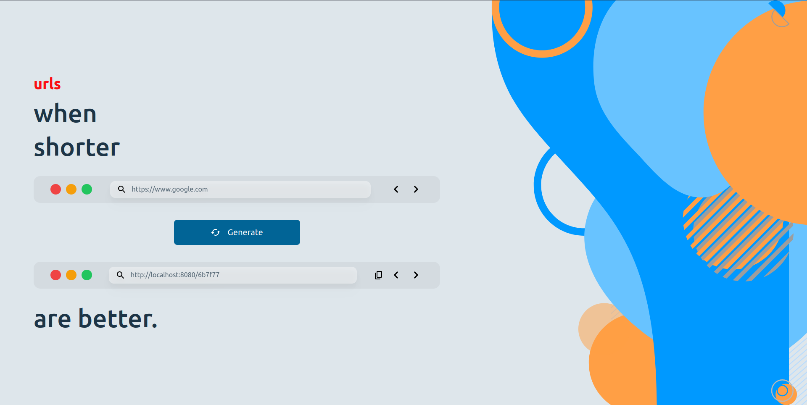

# URL Shortener

## Description
This is a simple project made using ReactJS and SpringBoot to demonstrate the working of an URL shortener. The application takes an URL from the user and then generates a smaller URL by hashing it in the backend. The generated URL can be used to get to the original page.

## Tech Stack
1. Frontend: NextJS
2. Backend: SpringBoot
3. Database: Apache Cassandra

## Getting started
TODO
